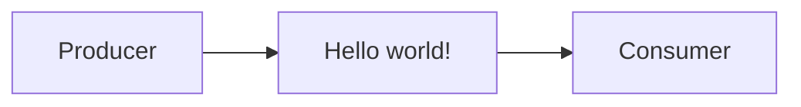

# 🐇 Advanced Message Queuing Protocol (Rabbit MQ)
O intuito desse repositório é testar e aprender a usar o sistema de mensageria que o RabbitMQ proporciona, durante todo o desenvolvimento vou explicando o conceito de cada etapa que a propria documentação do Rabbit proporciona para melhor aprendizado.

Cada etapa (exceto a primeira) será separada por Pull Requests para que possa ser mais fácil de identificar as etapas da versão final.

## ([#0](https://github.com/lucasgianine/message-queuing/commit/c86a7cd0750668b64d3e57371d61874107304e26)) Hello world!
O conceito dessa etapa é apresentar o básico da mensageria, teremos um <i>Producer</i> que irá enviar uma mensagem, a <i>queue</i>, ou <i>fila</i> que irá fazer o processo onde tranformará a mensagem em um buffer para que, finalmente, seja entregue ao <i>Consumer</i>, que imprimirá a mensagem.

