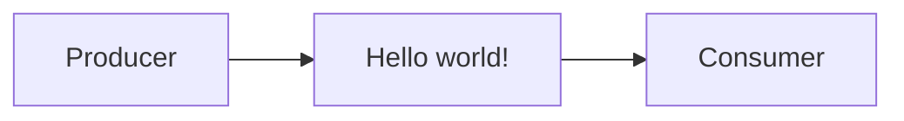
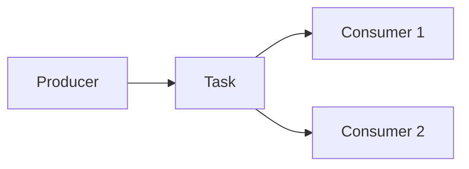
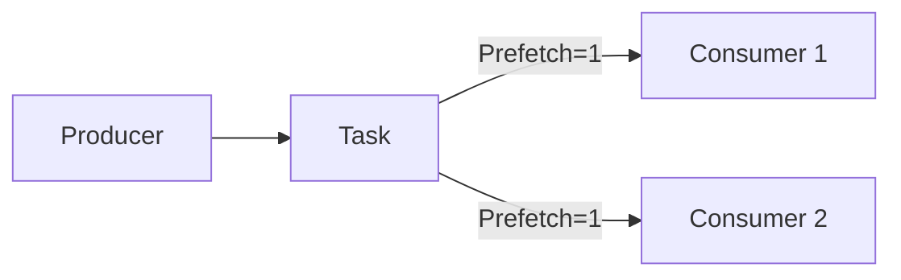
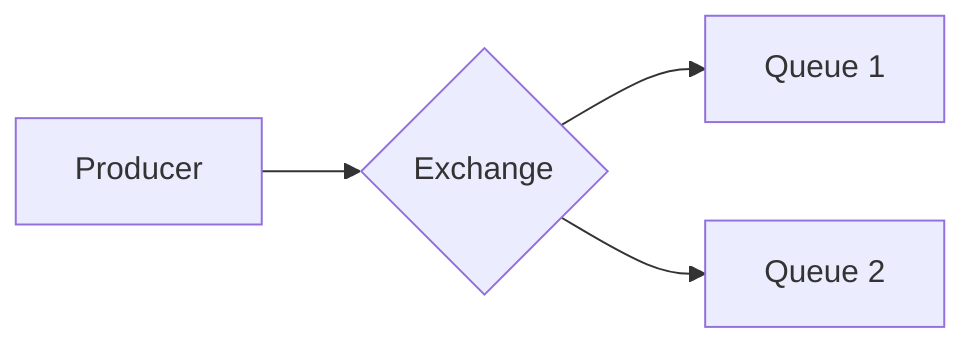
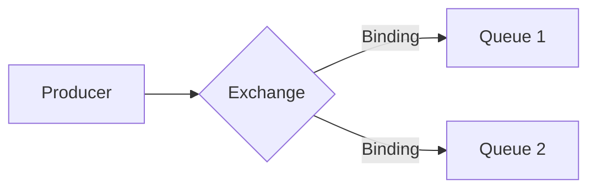
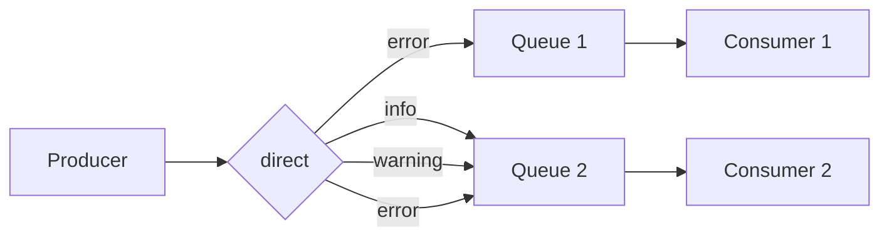

# 🐇 Advanced Message Queuing Protocol (Rabbit MQ)
O intuito desse repositório é testar e aprender a usar o sistema de mensageria que o RabbitMQ proporciona, durante todo o desenvolvimento vou explicando o conceito de cada etapa que a propria documentação do Rabbit proporciona para melhor aprendizado.

Cada etapa (exceto a primeira) será separada por Pull Requests para que possa ser mais fácil de identificar as etapas da versão final.

## ([#0](https://github.com/lucasgianine/message-queuing/commit/c86a7cd0750668b64d3e57371d61874107304e26)) Hello world!
O conceito dessa etapa é apresentar o básico da mensageria, teremos um <i>Producer</i> que irá enviar uma mensagem, a <i>queue</i>, ou <i>fila</i> que irá fazer o processo onde armazenará a mensagem em um buffer para que, finalmente, seja entregue ao <i>Consumer</i>, que imprimirá a mensagem.



Utilize esses comandos para teste:
```bash
  # shell 1
  npm run consumer

  # -> [*] Waiting for messages. To exit press CTRL+C
  # -> [x] Received Hello World!
```

```bash
  # shell 2
  npm run producer

  # -> [x] Sent: Hello World!
```

## ([#1](https://github.com/lucasgianine/message-queuing/pull/1)) Work Queues
Vamos trabalhar em criar Work Queues (ou Task Queues) para distribuir tarefas demoradas entre vários workers, ou seja, quando uma tarefa exije muitos recursos, todo fluxo espera que ela seja concluída para que a mensagem seja exibida, a ideia do Work Queues é que agendemos a tarefa para que ela seja feita mais tarde.



Utilize esses comandos para teste:
```bash
  # shell 1
  npm run consumer

  # -> [*] Waiting for messages. To exit press CTRL+C
  # -> [x] Received <mesagem>!
  # -> [x] Done
```

```bash
  # shell 2
  npm run producer <mensagem>

  # -> [x] Sent: <mensagem>
```

#### Round-robin dispatching
Durante esse teste, existe uma maneira de distribuição que é chamada de `round-robin`, que por padrão, cada mensagem será enviada por sequencia, fazendo com que cada consumidor receba o mesmo número de mensagens, a diferença é que as mensagens serão distribuídas em shell diferentes.
Se executarmos o `npm run consumer` em dois shell, e depois enviarmos as mensagems, podemos ver que cada um terá diferentes resultados, pois foram distribuídos em sequeência.

#### Message acknowledgment
Ás vezes, fazer uma tarefa leva alguns segundos, e por sua vez, algumas tarefas acabam morrendo no meio do caminho sem ter chance de serem executadas, e tudo que estava sendo processado acaba sendo perdido no meio do caminho, e se fizessemos algo para que, assim que uma tarefa morrer, ela passasse seu trabalho (que estava em andamento) para o próximo <i>producer</i>?
```typescript
  // worker.js
  noAck: false // acknowledgment mode
```
Aplicar noAck como `false` (que anteriormente era `true`) garante que, mesmo que você encerre um worker (com CTRL+C) nada será perdido, todas as mensagens não confirmadas serão reenviadas (desde que esteja no mesmo canal em que ela foi enviada).

#### Message durability
Ainda que garantimos que mesmo que o <i>consumer</i> acabe, as mensagens ainda existam, não garantimos que se o servidor RabbitMQ parar essas mesmas mensagens deixem de existir, pois quando o RabbitMQ para ele esquece todas as queues e mensagens, a não ser que façamos ele lembrar.
Fazemos ele se lembrar das queues utilizando `durable`, e para as mensagens `persistent`
```typescript
  channel.assertQueue(queue, {
      durable: true
    })

  channel.sendToQueue(queue, Buffer.from(message), {
    persistent: true
  })
```

#### Fair dispatch
Esse método é interessante por um motivo: Supondo que mensagens ímpares sejam pesadas e mensagens pares sejam leves, um trabalhador ficará constantemente ocupado e outro quase não terá trabalho para fazer, o Rabbit faz com que as mensagens sejam enviadas uniformemente, sem se preocupar com isso, pois ele só despacha as mensagens que entram na queue/fila



Pra corrigir esse feito, usamos `prefetch` com o valor `1` para que o Rabbit entenda não dará mais de uma mensagem para um trabalhador por vez enquanto a mensagem não for concluída até que um trabalhador esteja livre.
```typescript
  channel.prefetch(1)
```

## ([#2](https://github.com/lucasgianine/message-queuing/pull/2)) Publish/Subscribe
Dessa vez iremos entregar uma mensagem para vários consumidores, criaremos um registro simples com dois programas, onde um emitirá mensagens de registro e outro que vai receber e imprimir, no nosso programa, cada cópia em execução do receptor receberá as mensagens, onde o receptor poderá se comunicar com os dois queues ao mesmo tempo.

Toda ideia do Rabbit é que, na verdade o <i>producer</i> nunca envie mensagem diretamente para fila (pois na realidade é que o <i>producer</i> nem sabe se a mensagem chegará até lá), mas ao invés disso ele envie mensagens para uma `exchange`, pois ela sabe exatamente o que fazer com a mensagem que recebeu para empurrá-lá para uma <i>queue</i>.



Há alguns tipos de exchanges, mas vamos trabalhar em cima do `fanout`: Ela transmite todas as mensagens que recebe para todas as filas que ela tem conhecimento.
```typescript
  channel.assertExchange('logs', 'fanout', { durable: false })
```

#### Filas temporárias
Dar o nome para uma fila é importante para compartilharmos ela entre os <i>produces</i> e <i>consumers</i>, mas no caso dessa aplicação de logs, não precisamos criar uma fila permanente, deixaremos o nome da fila vazio para que o próprio servidor possa dar um nome aleatório, já que nesse momento isso não é prioritário visto que a fila, depois de ser consumida, deverá ser apagada automaticamente.
```typescript
  channel.assertQueue('', {
    exclusive: true
  })

  // Exemplo de retorno: amq.gen-JzTY20BRgKO-HjmUJj0wLg
```

Depois de todo o processo de criar <i>exchange</i> e as filas temporárias agora vamos fazer nossa <i>exchange</i> enviar mensagem para a <i>fila</i>.


Chamamos de `binding` (traduzido: Vinculação) o relacionamento entre exchange (troca) e uma queue (fila).
"Pode ser lido como: A queue está interessada em mensagens dessa exchange."
```typescript
  channel.bindQueue(queue_name, 'logs', '')
```

Utilize esses comandos para teste:
```bash
  # shell 1
  npm run receive_logs

  # -> Será criado um arquivo .log na pasta src/logs
  # -> No arquivo aparecerá a <mensagem> escrita no próximo shell
```

```bash
  # shell 2
  npm run emit_logs <mensagem>

  # -> [x] Sent: <mensagem>
```

De forma simples: Criamos um sistema de registro simples que trasmite mensagens de registros (logs) para receptores.

## ([#3](https://github.com/lucasgianine/message-queuing/pull/3)) Routing
Trabalharemos com roteamento junto ao que foi aprendido no item anterior, redirecionaremos mensagens de erros críticas para o arquivo de log (economizando espaço no disco).
Ainda trabalharemos em cima das bindings, e dessa vez, passaremos parâmetros de chave de binding para que possamos fazer uma <i>exchange</i> direta para diversas queues

Anteriormente enviávamos mensagens para todos os <i>consumers</i> sem nenhuma filtragem, isso se dava ao fato de usarmos a troca `fanout`, dessa vez usaremos a troca `direct` que enviará mensagens para queues específicas, e todas as outras mensagens sem um binding key serão descartadas.

```typescript
// logs/emit_logs.js
const exchange = 'direct_logs'
channel.assertExchange(exchange, 'direct', {
  durable: false
})
channel.publish(exchange, severity, Buffer.from(message))
```

```typescript
// logs/receive_logs.js
args.forEach((severity) => {
  channel.bindQueue(q.queue, exchange, severity)
})
```

Aplicaremos esse tipo de troca no nosso sistema de logs, trocaremos `fanout` por `direct` e forneceremos uma `routing key` na hora de publicar para selecionar a gravidade que o receptor irá receber.
`severity` é o tipo de `routing key` que passaremos, nesse caso vamos assumir que ela seja `info`, `warning` ou `error`.



Utilize esses comandos para teste:
```bash
  # shell 1
  npm run receive_logs

  # -> Será criado um arquivo .log na pasta src/logs
  # -> No arquivo aparecerá a <rountingKey> e a <mensagem> escrita no próximo shell
```

```bash
  # shell 2
  npm run emit_logs <rountingKey> <mensagem>

  # -> [x] Sent '<rountingKey>': <mensagem>
```

## Referência
- [RabbitMQ](https://www.rabbitmq.com/)
- [Documentação do RabbitMQ](https://www.rabbitmq.com/tutorials)
