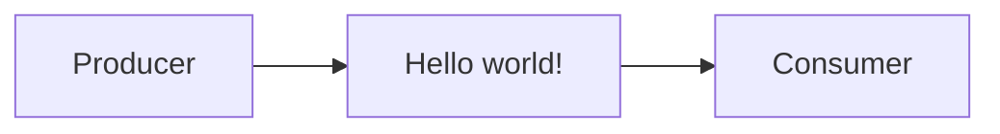
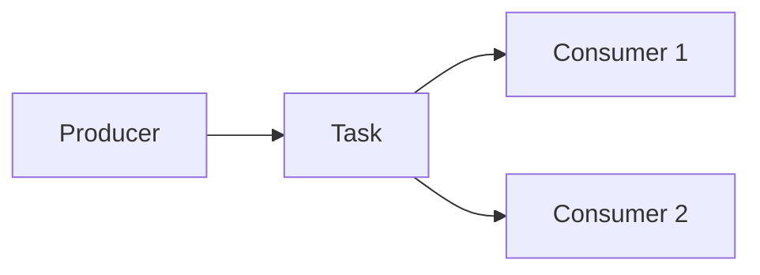
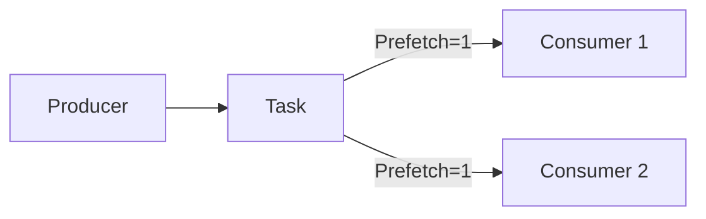

# 🐇 Advanced Message Queuing Protocol (Rabbit MQ)
O intuito desse repositório é testar e aprender a usar o sistema de mensageria que o RabbitMQ proporciona, durante todo o desenvolvimento vou explicando o conceito de cada etapa que a propria documentação do Rabbit proporciona para melhor aprendizado.

Cada etapa (exceto a primeira) será separada por Pull Requests para que possa ser mais fácil de identificar as etapas da versão final.

## ([#0](https://github.com/lucasgianine/message-queuing/commit/c86a7cd0750668b64d3e57371d61874107304e26)) Hello world!
O conceito dessa etapa é apresentar o básico da mensageria, teremos um <i>Producer</i> que irá enviar uma mensagem, a <i>queue</i>, ou <i>fila</i> que irá fazer o processo onde tranformará a mensagem em um buffer para que, finalmente, seja entregue ao <i>Consumer</i>, que imprimirá a mensagem.



Utilize esses comandos para teste:
```bash
  # shell 1
  npm run consumer

  # -> [*] Waiting for messages. To exit press CTRL+C
  # -> [x] Received Hello World!
```

```bash
  # shell 2
  npm run producer

  # -> [x] Sent: Hello World!
```

## (#1) Work Queues
Vamos trabalhar em criar Work Queues (ou Task Queues) para distribuir tarefas demoradas entre vários workers, ou seja, quando uma tarefa exije muitos recursos, todo fluxo espera que ela seja concluída para que a mensagem seja exibida, a ideia do Work Queues é que agendemos a tarefa para que ela seja feita mais tarde.



Utilize esses comandos para teste:
```bash
  # shell 1
  npm run consumer

  # -> [*] Waiting for messages. To exit press CTRL+C
  # -> [x] Received <mesagem>!
  # -> [x] Done
```

```bash
  # shell 2
  npm run producer <mensagem>

  # -> [x] Sent: <mensagem>
```

#### Round-robin dispatching
Durante esse teste, existe uma maneira de distribuição que é chamada de `round-robin`, que por padrão, cada mensagem será enviada por sequencia, fazendo com que cada consumidor receba o mesmo número de mensagens, a diferença é que as mensagens serão distribuídas em shell diferentes.
Se executarmos o `npm run consumer` em dois shell, e depois enviarmos as mensagems, podemos ver que cada um terá diferentes resultados, pois foram distribuídos em sequeência.

#### Message acknowledgment
Ás vezes, fazer uma tarefa leva alguns segundos, e por sua vez, algumas tarefas acabam morrendo no meio do caminho sem ter chance de serem executadas, e tudo que estava sendo processado acaba sendo perdido no meio do caminho, e se fizessemos algo para que, assim que uma tarefa morrer, ela passasse seu trabalho (que estava em andamento) para o próximo <i>producer</i>?
```typescript
  // worker.js
  noAck: false // acknowledgment mode
```
Aplicar noAck como `false` (que anteriormente era `true`) garante que, mesmo que você encerre um worker (com CTRL+C) nada será perdido, todas as mensagens não confirmadas serão reenviadas (desde que esteja no mesmo canal em que ela foi enviada).

#### Message durability
Ainda que garantimos que mesmo que o <i>consumer</i> acabe, as mensagens ainda existam, não garantimos que se o servidor RabbitMQ parar essas mesmas mensagens deixem de existir, pois quando o RabbitMQ para ele esquece todas as queues e mensagens, a não ser que façamos ele lembrar.
Fazemos ele se lembrar das queues utilizando `durable`, e para as mensagens `persistent`
```typescript
  channel.assertQueue(queue, {
      durable: true
    })

  channel.sendToQueue(queue, Buffer.from(message), {
    persistent: true
  })
```

#### Fair dispatch
Esse método é interessante por um motivo: Supondo que mensagens ímpares sejam pesadas e mensagens pares sejam leves, um trabalhador ficará constantemente ocupado e outro quase não terá trabalho para fazer, o Rabbit faz com que as mensagens sejam enviadas uniformemente, sem se preocupar com isso, pois ele só despacha as mensagens que entram na queue/fila



Pra corrigir esse feito, usamos `prefetch` com o valor `1` para que o Rabbit entenda não dará mais de uma mensagem para um trabalhador por vez enquanto a mensagem não for concluída até que um trabalhador esteja livre.
```typescript
  channel.prefetch(1)
```
